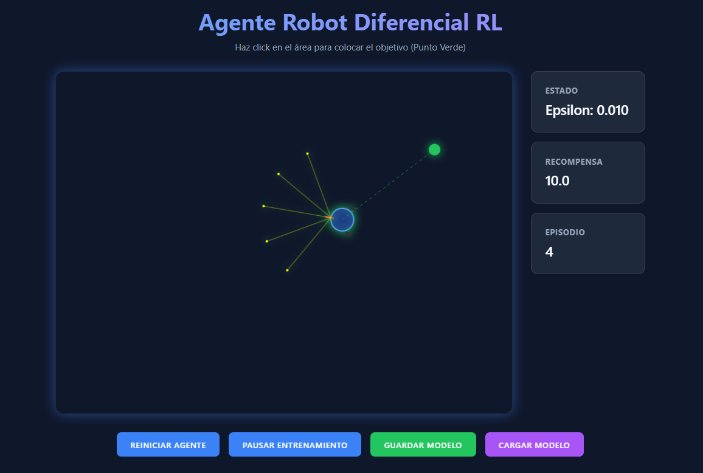

# Robot-Diferencial-Aprendizaje-por-Refuerzo

Este proyecto implementa un **agente de Aprendizaje por Refuerzo Profundo (DQN)** que controla un robot móvil diferencial en un entorno 2D dentro del navegador. El robot percibe el entorno mediante sensores de distancia y aprende a **navegar hacia un objetivo** (punto verde) evitando colisionar con las paredes.

Todo corre en el navegador utilizando **HTML5 Canvas**, **JavaScript** y **TensorFlow.js**.


# Robot Diferencial RL (Web Demo)

<div align="center">
  
</div>

<h6 align="center">
    Simulación en navegador de un robot diferencial controlado con Deep Q-Learning usando TensorFlow.js
</h6>


---


## 📂 Estructura del proyecto

```text
.
├── index.html      # Contiene el canvas, panel de estado y botones de control
├── style.css       # Estilos de la UI (layout, colores, tipografía)
├── script.js       # Lógica del agente RL, simulación y rendering
